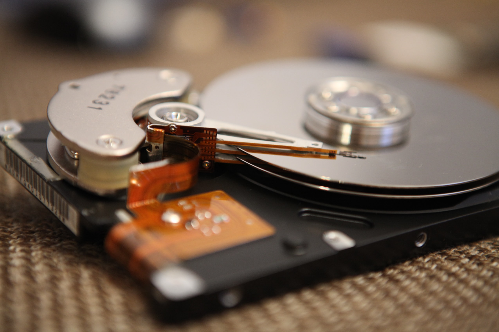

When it comes to family pictures and videos, no amount of money can recreate them if they're lost.

This fact dawned on me a couple of weeks ago when I realised that the majority of my family videos existed exclusively on a dozen or so tapes.

This was a disaster waiting to happen. Any number of events leading to the loss or damage of those tapes would've resulted in the erasion of over a decade of precious memories.

So, I had to find a way to digitise the media and store it in such a way that it would be safe, organised, and accessible.

## Digitising the media

My old camcorder records to [MiniDV tapes](https://en.wikipedia.org/wiki/DV#Magnetic_tape), meaning I first had to record these tapes into a video file.

Connecting the camcorder to my MacBook required two adapters: one from FireWire to Thunderbolt, and one from Thunderbolt to Thunderbolt 3.

After connecting the daisy chain of cables and adapters, I was able to play the tape on the camcorder and have it recorded straight into iMovie.

This was a tedious process as the tapes had to be recorded at normal speed. iMovie also separates out clips on the tape, so you have to stitch together any clips you want in the same video.

## Compressing and optimising

Each hour-long tape captured by iMovie averaged around 2.5 GB before being compressed and optimised.

With the prospect of backing up around a dozen of these tapes, it was crucial to reduce the size of these files as much as possible.

[High Efficiency Video Coding (HEVC)](https://en.wikipedia.org/wiki/High_Efficiency_Video_Coding) is currently the gold standard of video compression, and is the successor of [Advanced Video Coding (AVC)](https://en.wikipedia.org/wiki/Advanced_Video_Coding).

In comparison to AVC, HEVC offers from 25% to 50% better data compression at the same level of video quality, or substantially improved video quality at the same bit rate.

The best way I found to convert the large files to the HEVC standard, whilst complying with Apple’s very specific rules around encoding, was to use [FFmpeg](https://en.wikipedia.org/wiki/FFmpeg) as excellently explained [here](https://brandur.org/fragments/ffmpeg-h265).

The process of converting the files took a while, but was definitely worth it. I wasn't able to notice any reduction in the quality of the videos, and succeeded in shrinking each file to less than 300 MB!

## The 3-2-1 backup rule

Once I had the videos optimised, I needed to store them in such a way that they would be safe, organised, and accessible.

The golden 3-2-1 backup rule states that you should have 3 copies of the data: 2 local copies, and 1 offsite backup.

By doing so, you ensure your data is secure in the event of any unforeseen incident.

Keeping 2 local copies of the data can be as simple as keeping an extra backup on an external SSD.

As for the offsite backup, whilst iCloud isn't free past 5 GB of storage, it’s definitely worth the money if you use Apple devices.

By uploading everything to iCloud, you ensure a rock-solid offsite backup, and can easily access the files from your devices anywhere in the world.

## Conclusion

Backing up home videos can be a laborious process, but it's a small price to pay when compared to the risk of losing such precious memories.

HEVC ensures that the videos are optimised so they take up as little space as possible, and can be transferred more quickly.

Using iCloud ensures the data is safe in the event you lose one or both of your local backups. It also keeps everything organised, freely accessible from your devices, and makes sharing the videos with family and friends a breeze.

Of course, you need to make sure that your iCloud account is properly secured, and that you don't get locked out of your account!

## Links

- [Apple-compatible HEVC](https://brandur.org/fragments/ffmpeg-h265)
