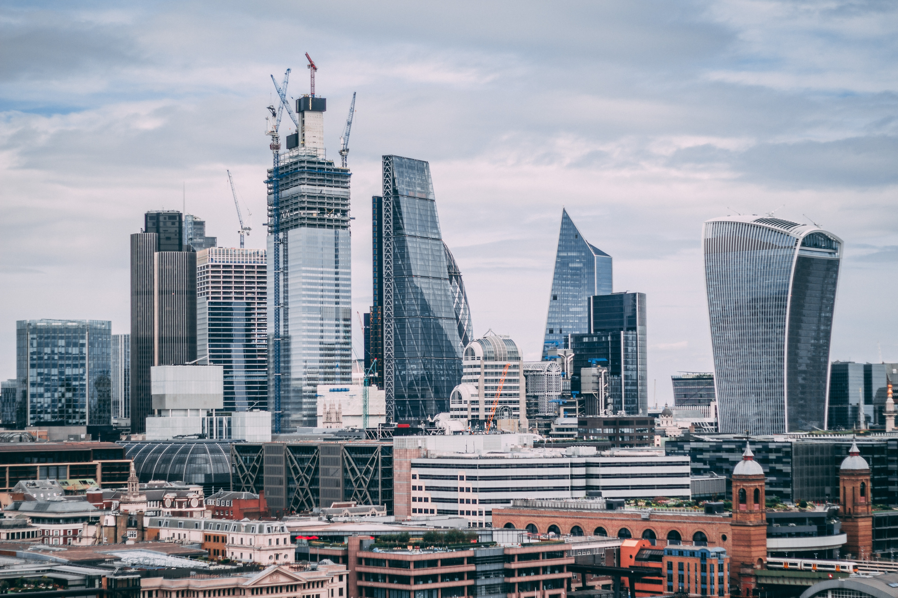
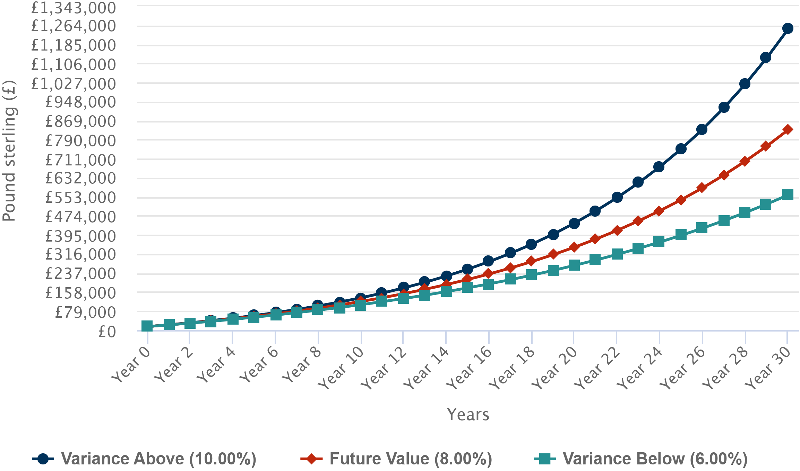

Compound interest is often referred to as the eighth wonder of the world, and Albert Einstein once said that "He who understands it, earns it… he who doesn't… pays it."

Indeed, the snowballing nature of compound interest makes it the hidden power behind why investing for the long term works so well.

In order to leverage the power of compound interest, all we need is time – the most powerful tool you have.

## A worked example

Let's assume that, starting today, you decide to save £150 a month. After 10 years you save £18,000, you stop adding more money, and leave that money to be invested.

Now, let's say you tell a friend to do the same. But, instead of beginning at the same time as you, they have other priorities and don't start saving until 15 years later.

Later, they listen to your advice and start saving £150 a month. In fact, they feel they can save for longer, so they carry on saving monthly for the next 25 years, putting away £45,000 in total. Two and a half times as much as you did.

However, when we look 40 years down the line at you and your friend's investments, the power of compounding means that you come out better than your friend.

Assuming your investments both grew by 5% a year on average, you would have £100,480, and your friend just £88,218.

They would have £12,262 less than you, despite saving £27,000 more and doing so for a longer period of time. As you can see, while the best time to have started saving is 10 years ago, the next best time is today.

## The stock market

Note that 5% is not a realistic "interest" rate when it comes to a bank account - at least not currently. When talking about these larger returns, we're referring to numbers you can achieve by investments in stocks.

Here, the rate of return can vary for any given year, but is generally in the 6-10% range depending on your time frame and what you invest in. There are years when the stock market is down and years where it’s up, but the overall long-term trend is up, which makes compounding work for us.

While you could theoretically put all of your savings into just one or two stocks to achieve very high returns, doing so is inherently very risky as you are placing an extremely outsized bet.

As such, investing in a fund is far less risky as we diversify our investments by investing in a larger number of stocks. Even still, there are hundreds of funds to choose from.

## Active vs. passive

While there are many types of funds, we can divide them all broadly into two main categories: active and passive.

An active fund is one that’s designed to outperform a market-cap weighted benchmark. For example, a UK equity fund designed to outperform the FTSE 100 is an active fund.

Active investing, as its name implies, takes a hands-on approach and requires that someone act in the role of a portfolio manager. The goal of active management is to beat the stock market’s average returns and take full advantage of short-term price fluctuations. The [Fundsmith Equity Fund](https://www.fundsmith.co.uk/fund-factsheet) is one example.

  
  <figcaption>Traditional active managers, the gazelles, are under increasingly intense pressure to demonstrate value for investors. They’re fighting for survival against their passive predators</figcaption>

On the other hand, passive investment funds maximise returns by minimising buying and selling. Index investing is one common passive investing strategy whereby investors purchase a representative benchmark, such as the [S&P 500](https://en.wikipedia.org/wiki/S%26P_500) index, and hold it over a long time horizon.

You can read more about the active vs passive argument [here](https://occaminvesting.co.uk/why-passive-investing-is-increasing-market-efficiency/). However, in general, active funds have the potential to achieve higher returns but are much riskier in the long term, while passive funds achieve a fairly consistent return and are far less risky.

## In practice

You should always do your own research when choosing a fund but, in general, the more diversification the better. This means spreading your investment across a wide range of sectors and geographical regions. Read more about choosing the right index fund [here](https://occaminvesting.co.uk/best-vanguard-passive-index-tracker-fund-uk/).

If you're a UK investor, the most diversified portfolio fund you can invest in is the [FTSE Global All Cap Index Fund](https://www.vanguardinvestor.co.uk/investments/vanguard-ftse-global-all-cap-index-fund-gbp-acc). It covers large, mid-sized, and small company shares in developed and emerging markets around the world.

Once you've selected the right fund, all that is left to do is find a good provider and utilise tax wrappers. If you're in the UK, this means maximising your £20,000 tax-free ISA allowance and choosing a reliable provider like Vanguard.

At the start of your investment journey, you should try to make a large lump sum contribution to get things kickstarted. It's then best to maximise the power of compound interest by making monthly contributions to your fund - enough that you can feel the money leaving but not too much that it leaves you out of pocket.

Importantly, you should remember that there will be years when the stock market will be down, but it's key to hold tight during times like that and not make knee-jerk decisions. Remember that the overall long-term trend is up, and that's all that matters.

## What to expect

Let's say you've chosen to invest in a global passive fund that averages a 6-10% return per year. By investing an initial lump sum of £15,000, and then proceed to contribute £500 per month thereafter, you could expect the following after 30 years:

In the best-case scenario (10% annually), you would have £1,248,705, while in the worst-case scenario (6% annually) you would have £560,501. Somewhere in the middle, assuming 8% annually, you could expect around £830,639.

Interestingly, waiting for just 5 years longer (35 years total), the best-case scenario shoots up to £2,047,683, the worst to £783,900, and the middle to £1,255,681.

This shows the real power of compound interest: its snowballing effect. It demonstrates that the big money is made in the final few years.

## Conclusion

Investing for the long term is one of the best financial decisions you can make for yourself. In fact, by taking this form of saving to the extreme, you might be able to join the [FIRE movement](https://en.wikipedia.org/wiki/FIRE_movement) (Financial Independence, Retire Early).

In essence, by saving heavily from a young age and being stoic, you can set yourself up to retire happily by the time you are 50 - or even earlier! If you're in the UK, take a look at the [FIREUK subreddit](https://www.reddit.com/r/FIREUK/) to find out more.

Improving your general financial hygiene is another significant step you can make towards financial freedom. Take a look at [the financial decision flowchart](https://ukpersonal.finance/flowchart/), the [Meaningful Money Podcast](https://meaningfulmoney.tv/mmpodcast/), and the [UKPersonalFinance subreddit](https://www.reddit.com/r/UKPersonalFinance/) to learn more.

Note that you should make sure to resolve and outstanding debts and other key financial decisions before venturing into investing. You should also steer well clear of short-term crypto fads and other get rich quick schemes.

_**Disclaimer:** Please note that this is not financial advice, and you should consult with an Independent Financial Advisor before making any financial decisions. For example, you might want to consider adding bonds into your portfolio in addition to equities to reduce volatility - something that is not covered here._
