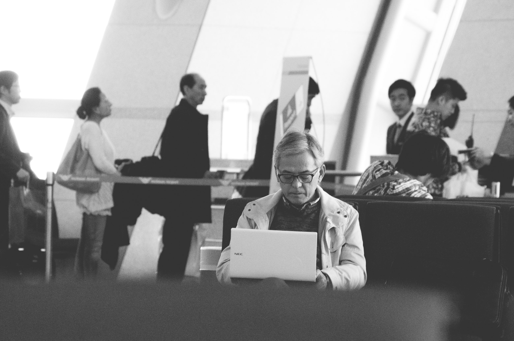
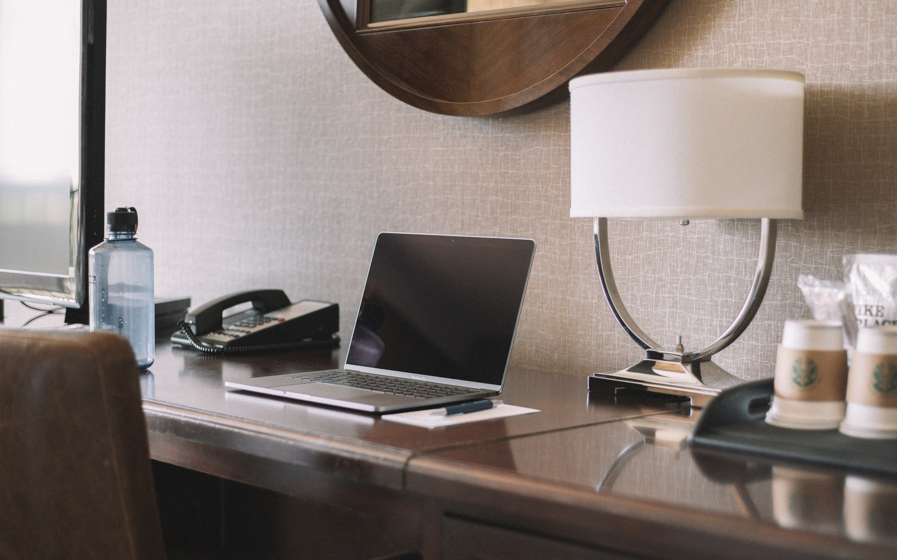
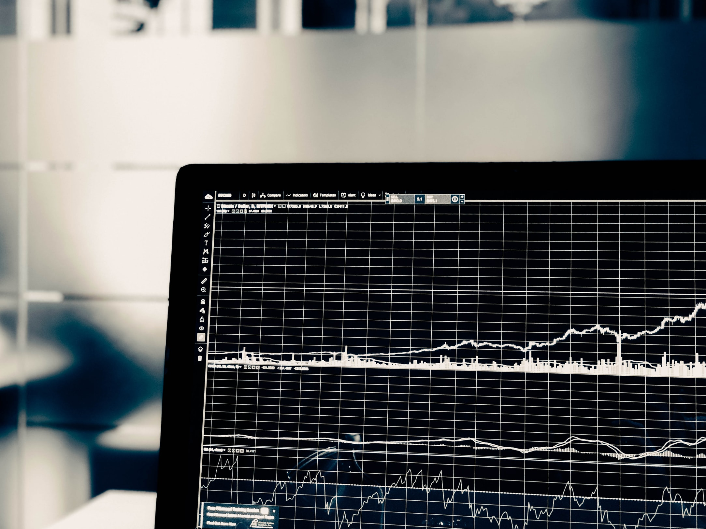

When we connect to a network, the access point can use our device's MAC address to identify, and even track us.

This is what a MAC address looks like:

```
00:1B:44:11:3A:B7
```

The first 6 digits identify the manufacturer (SanDisk in this case), and the last 6 are unique to that device.

When you go somewhere where you're asked to pay for internet access, you'll often be given log-in information to use on some log-in page.

When you sign in, the network notes down that your device, identified by its MAC address, and is allowed access.



Some free-to-use networks, like those at airports, might also use your MAC address to track you.

They can track which sites you visit, and even gather your travel patterns by looking at the times you connect to the network. This information could then be sold to advertisers who can leverage it for monetary gain.

Networks can do this because each MAC address is unique to a specific device — at least in theory anyway…

## Spoofing your MAC address

In practice, changing your MAC address is very simple, taking just one command on macOS.

There are 4 reasons you might want to change your MAC address:

1. Bypass login page
2. Bypass restriction
3. Random
4. Custom

### Bypassing login

The first reason is fairly self-explanatory: you might be stuck at the registration page for a network, unable to get in.

In this case, you scan the network for all MAC addresses, choose one, and clone it. The network is then tricked into thinking that you have access.



### Bypassing restriction

Other times, it might be necessary to bypass a network restriction that defines which manufacturer's devices can join (e.g. Microsoft devices only).

In this case, we once again scan the network for all MAC addresses and choose one, but instead of cloning it, we change just the last few characters — making it appear that your device is from the same manufacturer as the MAC address we chose.

### Preventing tracking

As mentioned before, it may sometimes be desirable to change your MAC address in order to avoid tracking whilst using a network

In this case, it doesn't really matter what we change our MAC address to, just that it is unique each time we use the network.

As a result, the easiest option is to generate a random MAC address. However, you may wish to choose a custom MAC address instead.



## Conclusion

MAC addresses are something that can be easily manipulated for a variety of purposes, allowing you to bypass certain restrictions.

Indeed, whilst you should always use a VPN when using a public network, randomising your MAC address can act as an extra precaution when it comes to preventing tracking.

If you're interested in trying out MAC address spoofing for yourself, I have written a python script, available [here](https://github.com/Tommrodrigues/MacSwapPy), which automates the processes outlined above.

## Links

- [Automated Python Script](https://github.com/Tommrodrigues/MacSwapPy)
