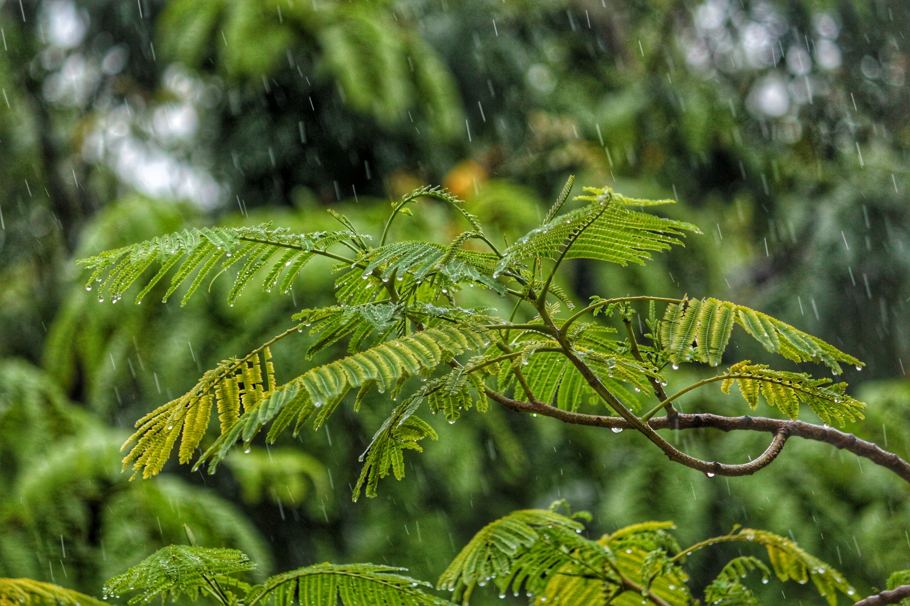
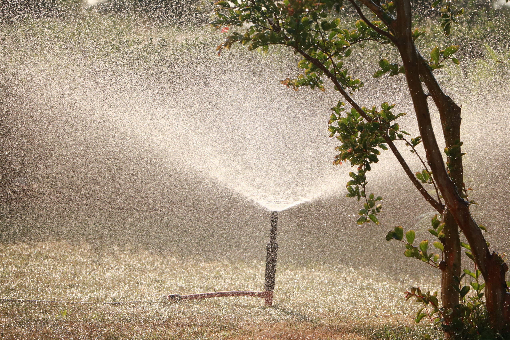

Smart sprinkler systems are some of the most popular smart home accessories, and can make a noticeable difference to your garden's health.

Features like weather forecasting allow smart sprinkler systems to look at the weather conditions for the next few days to determine factors such as rainfall, temperature, and cloud cover.

Using this information, the controller can adjust watering schedules and durations for each of the zones, and spread this across multiple cycles to optimise the conditions needed for each inidivdual garden.

However, as I outlined in my post about [My $99 Apple Smart Home](https://tommrodrigues.github.io/my-dollar99-apple-smart-home), not all of us are willing to foot the $300+ price tag that comes with devices like those from [Rachio](https://www.rachio.com).

This is what led me on my quest to design and build my very own smart sprinkler system for less than $10 using some cheap electronics and [Homebridge](https://github.com/homebridge/homebridge).

This post outlines how I achieved my goal, see [here](https://github.com/Tommrodrigues/homebridge-web-sprinklers/tree/master/examples) for more of a technical how-to.

## Weather forecasting

Using APIs like the [OpenWeatherMap API](https://openweathermap.org/api), you can easily make a request with your location and API key, then get back extensive weather forecasted weather data including whether it is expected to rain, what the high and low temperature will be, when sunrise is, and how cloudy it will be.

We can take this data, and if it doesn't reach certain thresholds like a minimum temperature for the high and low forecast, or if it is expected to rain, we can cancel the schedule.

Furthermore, some areas restrict which months/days you are allowed to water your garden, so we can compare the date against this list to ensure we abide by any such regulations.

## Calculating watering times

If our thresholds are met, we can use the weather data to adjust watering times positively or negatively from some default watering duration.

For example, we might want to increase the watering time if the day is going to be especially hot, but decrease the time if it is going to be cloudy.

After this, we can further refine the watering times for each of the zones, as some will require more or less watering than others.

After we have a duration for each of the zones, we can divide watering over multiple cycles to prevent runoff and improve plant health.

Finally, we can calculate the total amount of time required to complete the cycles for each of the zones, then subtract this from the sunrise time to get a start time for our watering schedule.

Doing this ensures that watering will finish by sunrise — the best time to finish watering to encourage proper absorption and prevent fungal growth.

## Implementation

Implementing this is fairly simple: we can just hook up a [NodeMCU](https://www.nodemcu.com/index_en.html) to a relay board connected to each of our sprinkler zones.

From here, our scheduling and watering times can be calculated by a the [homebridge-web-sprinkles](https://github.com/Tommrodrigues/homebridge-web-sprinklers) plugin, then executed at the correct times by the NodeMCU.

As a result, we can take a hands-free approach to looking after our garden as everything will be calculated for us in accordance with weather forecast calculations.

Because we have implemented this with [Apple HomeKit](https://www.apple.com/ios/home/), we can also have manual control over each zone, allowing us fo manually activate and deactivate each zone for whatever reason if we want to override the system.

## Conclusion

Making your own smart sprinkler system is ultimately very simple, and is a great way to save some money.

With some simple modifications, it also opens up a practically endless number of ways you can calculate watering times and schedules to gain more refined control over your garden.

## Links

- [Smart Sprinklers](https://github.com/Tommrodrigues/homebridge-web-sprinklers/tree/master/examples)
- [homebridge-web-sprinkles](https://github.com/Tommrodrigues/homebridge-web-sprinklers)
- [My $99 Apple Smart Home](https://tommrodrigues.github.io/my-dollar99-apple-smart-home)

P.S. Buy your parts from AliExpress, it’s way cheaper than Amazon!
