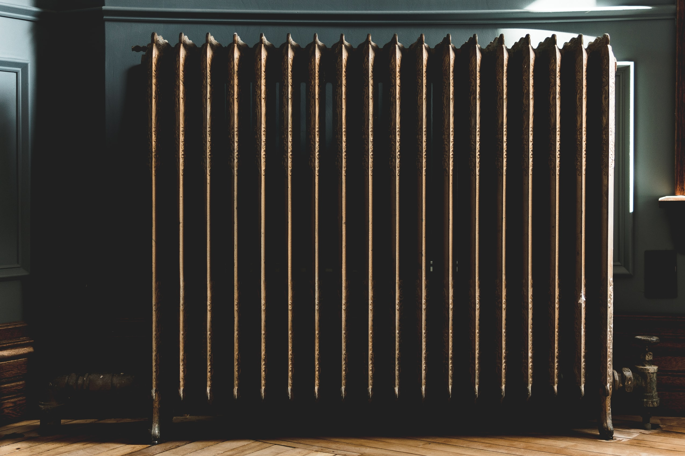
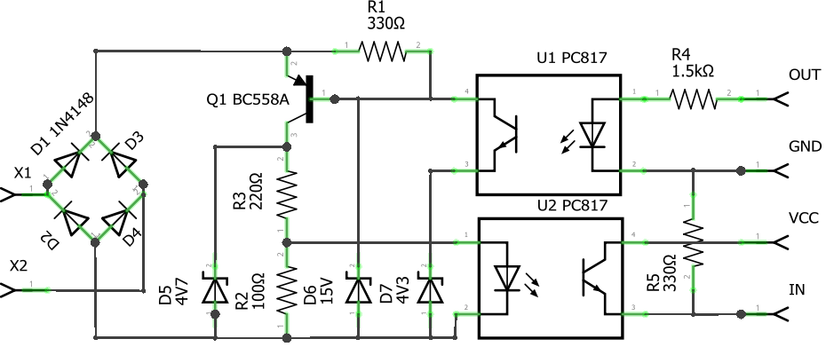
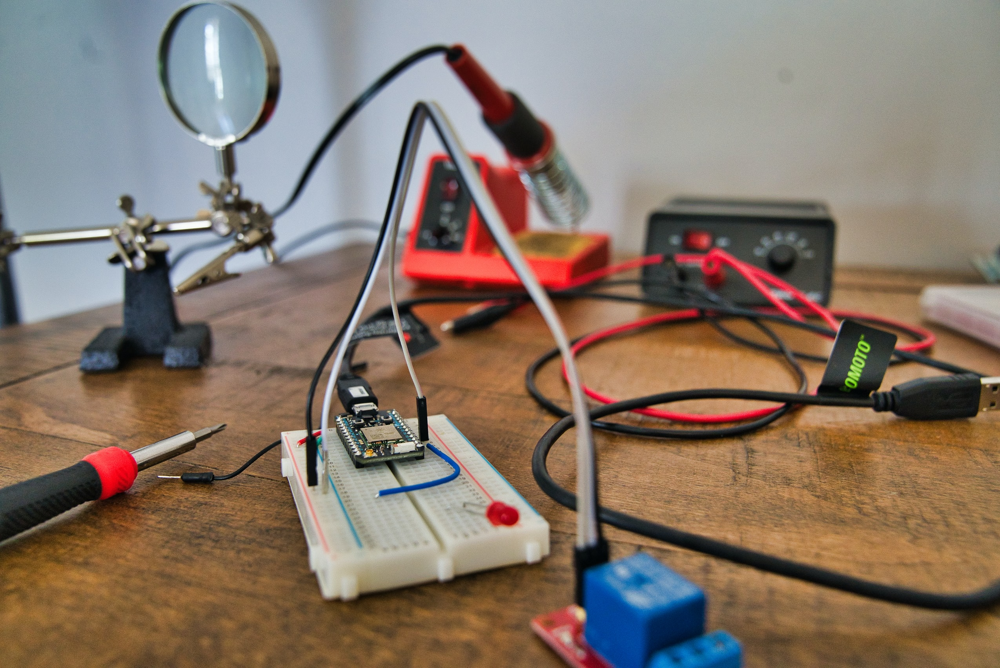
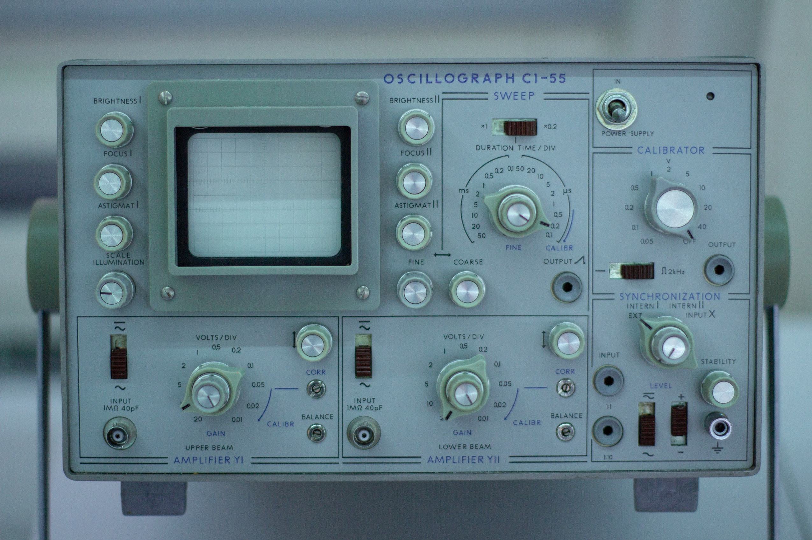

It's never been easier to make your home's heating smart — there's a seemingly endless number of smart thermostats available, like those from [Nest](https://store.google.com/us/magazine/compare_thermostats?hl=en-US&GoogleNest&utm_source=nest_redirect&utm_medium=google_oo&utm_campaign=GS103056&utm_term=thermostats) and [Honeywell](https://www.honeywellhome.com/en/products/thermostat).

Of course, as I outlined in my post about [My $99 Apple Smart Home](/my-dollar99-apple-smart-home), not all of us are willing to foot the $100+ price tag that comes with many of these smart devices.

This is what led me on my quest to design and build my very own smart thermostat for less than $10 using some cheap electronics and [Homebridge](https://github.com/homebridge/homebridge).

This post outlines how I achieved my goal, see [here](https://github.com/Tommrodrigues/homebridge-web-boiler/tree/master/examples) for more of a technical how-to.

## OpenTherm

[OpenTherm](https://en.wikipedia.org/wiki/OpenTherm) is a protocol used by many modern central heating systems to allow communication between a boiler and a thermostat.

The protocol is widely used across Europe and elsewhere in the world — chances are that if you have a relatively new boiler (within the last decade or so), you'll have support for the protocol.

The first question is: how do you get something like a [NodeMCU](https://www.nodemcu.com/index_en.html) to talk to a boiler using the OpenTherm protocol?

Well, thankfully, most of the work has already been done for us.

[This](http://ihormelnyk.com/arduino_opentherm_controller) blog outlines how to make an OpenTherm adapter to act as the interface between our NodeMCU, and our OpenTherm-compatible appliance.

The circuit diagram is as follows:

Nothing too complicated, just some resistors, diodes, optocouplers, and transistors.

However, if you've never had experience making your own circuits, and the schematic above scares you, you might feel more comfortable buying a pre-made adaptor from the [blog](http://ihormelnyk.com/shop/arduino_opentherm_controller).

Otherwise, if you're willing to give it a shot, and would rather not spend $15 on something you can make yourself for less than $10, simply buy the components listed on the blog, and solder them to some perfboard.

If you want to be super fancy, I've designed a PCB [here](https://github.com/Tommrodrigues/homebridge-web-boiler/tree/master/examples/OpenTherm%20PCB) which you could send off to be made for a couple of dollars, and save yourself a lot of headache when it comes to soldering the components you've ordered!

Once you've got your OpenTherm adapter, we're nearly there!

All that's left for hardware is something to feed in the ambient temperature to the NodeMCU. For this, I chose the DHT11 temperature sensor.

## Building the thermostat

Once we've wired the sensor and the adaptor up to the NodeMCU and connected everything to the boiler, we just need to focus on the software.

The NodeMCU will use a [PID controller](https://en.wikipedia.org/wiki/PID_controller) to control the boiler's temperature based on the ambient temperature.

The PID tracks changes to the ambient temperature, adjusting the boiler's output to get the ambient temperature as close to the desired temperature as possible.

Simply, if it's too warm, cool down the boiler, and vice-versa.

The NodeMCU manages all this for you and relays the information back to the [homebridge-web-boiler](https://github.com/Tommrodrigues/homebridge-web-boiler) plugin, so all you need to do is set the desired temperature in [Apple HomeKit](https://www.apple.com/ios/home/) — the rest will be taken care of.

## Tuning

The PID controller uses some set values to work out how it should behave.

For example, if your home is well insulated, it may require more even heating over a longer period of time. Another home might instead lose heat more quickly, so the controller should be more sensitive to sudden changes.

The values the PID uses are: Kp, Ki, and Kd. You can look up PID controller theory if you want more information on what each of the values is responsible for — but just know that these values will vary between homes.

A [PID auto-tuner](http://brettbeauregard.com/blog/2012/01/arduino-pid-autotune-library/) included on the NodeMCU makes finding the right values for your home easy.

Once you've set your thermostat up, you should run the auto-tuner when the ambient temperature and the boiler temperature are stable.

The auto-tuner will oscillate the boiler temperature very high and very low to see how the ambient temperature reacts. Note that this may take a few hours, and your home may become uncomfortably warm/cool whilst tuning is taking place

From the tuning, the NodeMCU can back-calculate figures for each of the PID values for your home. These are ballpark figures, and might require finer manual tuning to optimise them.

## Conclusion

Building your own smart thermostat is a relatively simple, and ultimately very rewarding task.

This DIY smart thermostat was a major addition to my smart home, and my family loves being able to control and schedule the heating easily from their phones.

I was also able to save more than $100, and the tuned PID controller does a far superior job maintaining a comfortable ambient temperature in my home than any of our previous thermostats have done.

## Links

- [Smart Thermostat](https://github.com/Tommrodrigues/homebridge-web-boiler/tree/master/examples)
- [homebridge-web-boiler](https://github.com/Tommrodrigues/homebridge-web-boiler)
- [PID Auto-tuner Post](http://brettbeauregard.com/blog/2012/01/arduino-pid-autotune-library/)
- [My $99 Apple Smart Home](/my-dollar99-apple-smart-home)
- [Opentherm Adapter Post](http://ihormelnyk.com/arduino_opentherm_controller)
- [OpenTherm Adapter PCB](https://github.com/Tommrodrigues/homebridge-web-boiler/tree/master/examples/OpenTherm%20PCB)

P.S. Buy your parts from AliExpress, it's way cheaper than Amazon!
