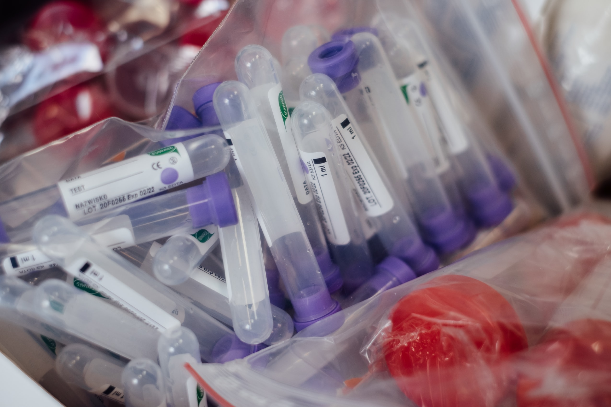
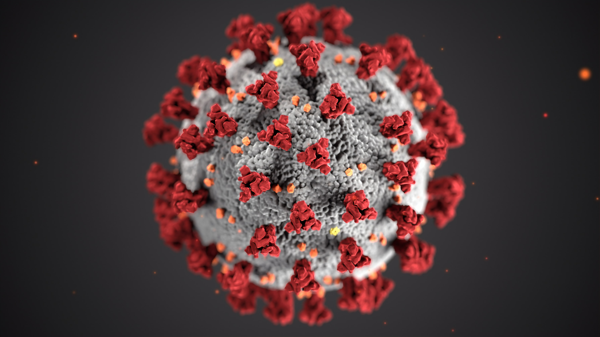
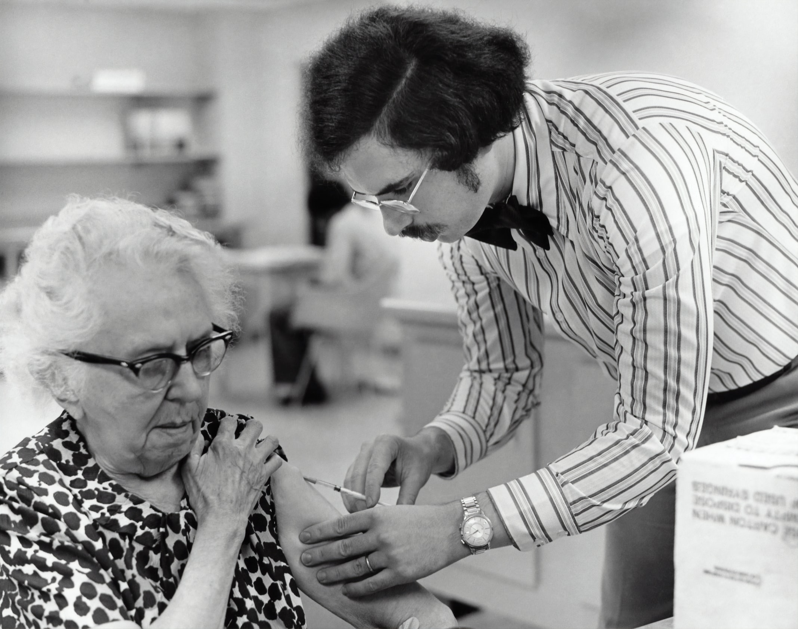
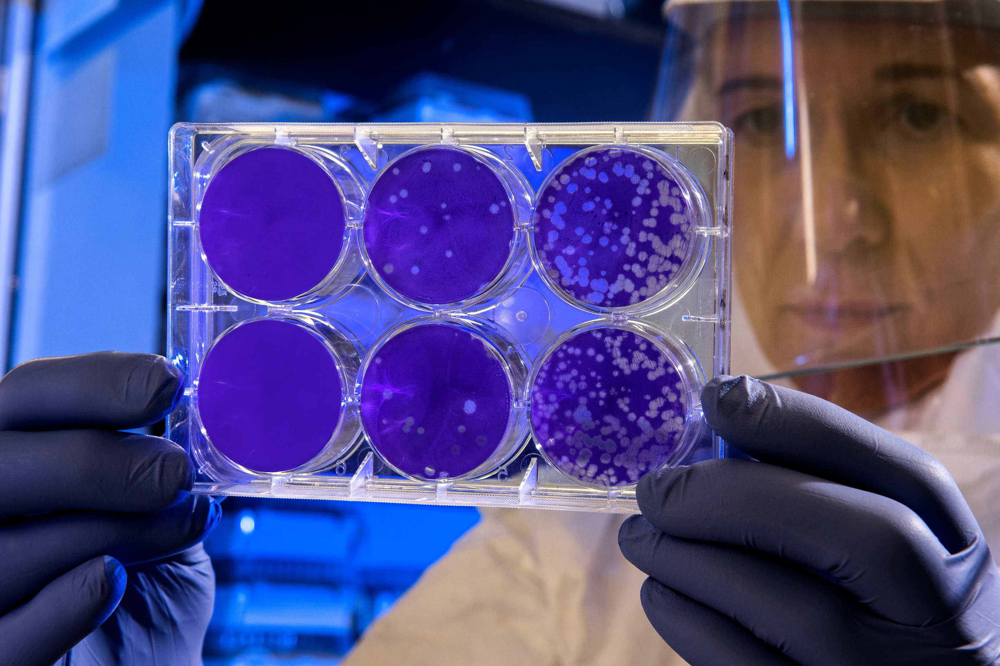

As the COVID-19 outbreak moves away from its peak phase, we enter a possibly more challenging period: managing the long-term presence of the virus.

We also face the reality that this pandemic was not the first, and will certainly not be the last of its kind. Experts have said for years that it is not a question of _if_, but _when_ we will face another viral pandemic.

The truth is, whilst this pandemic has been devastating in countless ways, it should really be seen as a warning shot. It shows that we continue to be unprepared for a pandemic of such a scale.

More worrying is if we consider a potential outbreak with the same transmission rate as SARS-CoV-2, but with a mortality rate more similar to a disease like Ebola.

In the roughly two-century history of modern vaccination practices, we've become fairly good at finding ways to protect ourselves from infectious diseases, and there’s little doubt that we'll do the same for SARS-CoV-2.

But developing a vaccine against a pathogen takes time, and in a pandemic situation, time is exactly what's at a premium.

## Basic immunology

The immune system is a remarkably complex system that is capable of recognising and eliminating invading organisms, then developing a memory of the invader so that future infections can be dealt with straight away.

At its heart, the immune system functions by responding to the proteins present on the surface invading pathogens: antigens.

The innate immune system is a rapid-reaction force of cells that bind to, and engulf, anything bearing non-self antigens.

The invader is broken down, and the antigens are presented to cells of the adaptive immune system, which then begins the slower process of creating antibodies that bind to the invader's antigens to eliminate them.

Once an infection has been dealt with, antibody production for the pathogen will greatly reduce, but the body will keep a memory of the invader. Thus, in the event of re-infection, the immune system will be able to respond far more rapidly.

## Traditional vaccinology

Traditionally, scientists have developed vaccines which protect us by exposing our immune systems to weakened versions of pathogens.

This prepares the immune system for a 'real' infection by triggering an immune response without you actually having to go through the disease process.

However, safely creating a version of the pathogen that correctly stimulates the immune system, without causing the disease it's meant to prevent, is very difficult.

This process of producing the vaccine typically requires the growing of viruses in chicken eggs or mammalian cell cultures, making it an incredibly slow, costly, and resource-intensive process.

## RNA vaccines

To shorten the development time of a new vaccine, scientists are attempting to leverage genetic engineering by essentially making people manufacture their own vaccine.

Unlike typical vaccines, which introduce viral proteins into the patient, RNA vaccines instead introduce the instructions for making those proteins in the patient's own cells.

Without going into too much depth, messenger RNA, or mRNA, is produced in cells during transcription, where sections of DNA inside the nucleus of a cell are copied.

This transcript moves out of the nucleus of the cell to be read by ribosomes which create strings of amino acids in a process called translation. These polypeptide strings then fold up into complex shapes that dictate their function as finished proteins.

An RNA vaccine, not at all unlike the the actual process of viral infection, seeks to place a specific genetic sequence into cells in such a way that it will be translated into proteins.

But, where a virus injects a complete genome into the host cell to hijack the cell's machinery to make more copies of itself, an RNA vaccine's payload is very limited, just containing the instructions for the antigens of the target pathogen.

Once the RNA vaccine has been introduced into a patient, the cells will dutifully translate the genetic code, producing the desired antigens.

By doing this, the patient's own cells are essentially doing the job normally done in chicken eggs or a cell culture, with no need for expensive and time-consuming purification of the final product.

## Conclusion

The RNA vaccine process sounds reasonably straightforward, but as with all things in biology, things are a little more complicated.

The main issue is that simply injecting raw RNA into a cell is unlikely to work, so focus is on delivering RNA vaccines via lipid nanoparticles. This lipid container protects the RNA, and makes uptake by the patient's cells more reliable.

Of course, once the finer details are worked out, the fact remains that by leveraging what our cells already do so well, we might be able to get vaccines for COVID-19, future pandemics, other diseases, and perhaps even cancer, to a waiting world much faster than by trying to do it the traditional way.
