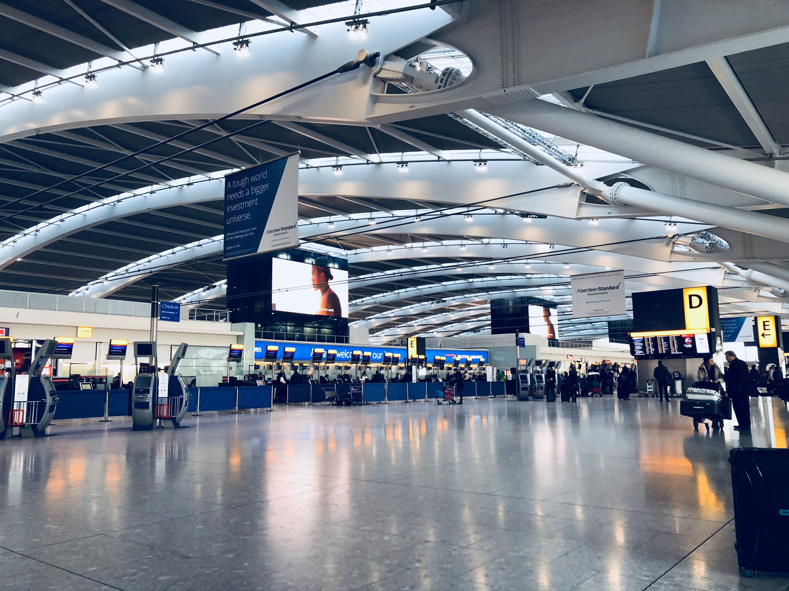
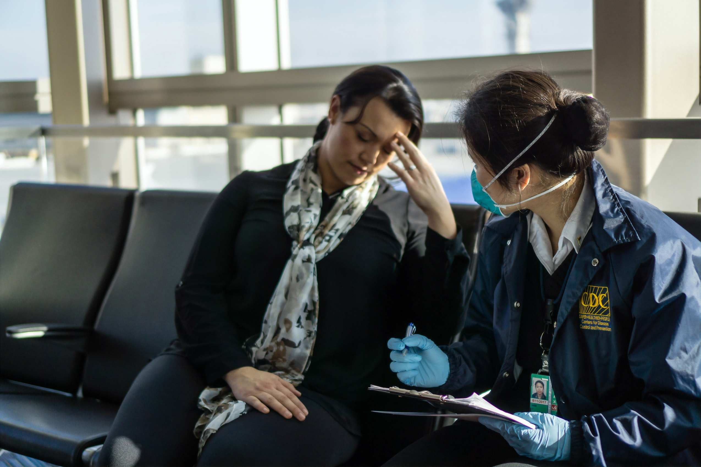
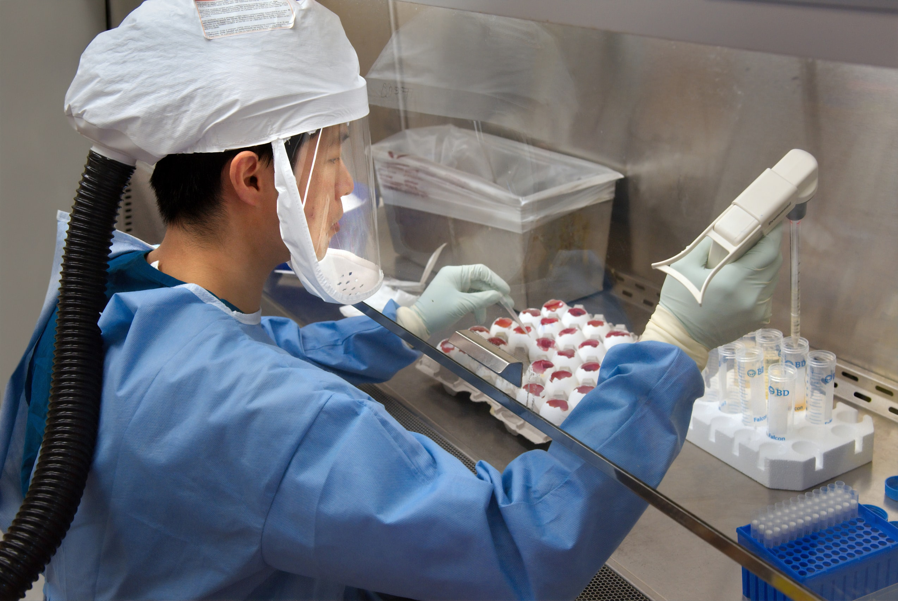

Shortly after the outbreak of the coronavirus, some countries halted international travel to certain high-risk nations, and many airports introduced safety measures including the thermal screening of passengers.

Thermal screening had previously been implemented during the 2003 SARS epidemic and the 2009 H1N1 pandemic, but the fact is that this type of screening does little more than reassure the public.

Evidence has shown that thermal screening fails to detect around a half of infected people, and ultimately does little to actually prevent the spread of the virus.

## Thermal screening

Thermal screening requires passengers have their temperature checked, then those with a fever resulting from the virus will be flagged and prevented from travelling.

This seems logical at first glance, but this screening method has two major issues: false positives and false negatives

The issue with false positives is that, as well as detecting people with a fever resulting from COVID-19, passengers with other types of illnesses which cause a fever will be flagged as well.

This was [the case in Australia](https://pubmed.ncbi.nlm.nih.gov/14984341/) when entry screening was implemented in response to the 2003 SARS outbreak: 1.84 million people were screened, 794 were quarantined, and 0 cases were confirmed.

Of course, false positives are arguably an acceptable cost if it can be guaranteed that all those who _do_ have COVID-19 will be detected.

However, evidence has shown that thermal screening fails to detect a large percentage of infected people: false negatives.

This was certainly [the case in Canada](https://www.ncbi.nlm.nih.gov/pmc/articles/PMC3294328/) during the SARS outbreak where the nation saw 251 cases, yet its intensive border screening failed to detect a single one.

## The evidence

A [study published](https://www.eurosurveillance.org/content/10.2807/1560-7917.ES.2020.25.5.2000080) by the London School of Hygiene and Tropical Medicine used a [computer model](https://cmmid-lshtm.shinyapps.io/traveller_screening/) to evaluate the effectiveness of thermal screening by simulating 100 infected travellers who could pose a COVID-19 risk to a new region.

By taking into account travel time, incubation time, asymptomatic cases, and the accuracy of detection machines, they calculated that 46 of the 100 infected passengers would pass through screening completely undetected.

The main problem is that the incubation time of the virus can be as long as 14 days, with an average of 5.2 days assumed in the analysis. During this time, an infected person would not present a fever, but could still be contagious.

Moreover, some percentage of people infected with the coronavirus may be totally asymptomatic, or have such mild symptoms that they don't present a fever but still pose a transmission risk.

The European Centre for Disease Prevention and Control (ECDC) has [concluded that](https://www.ecdc.europa.eu/sites/default/files/documents/Considerations-related-to-measures-for-travellers-reduce-spread-COVID-19-in-EUEEA.pdf): "Scientific evidence does not support entry screening as an efficient measure for detecting incoming travellers with infectious diseases".

Unsurprisingly, the World Health Organization (WHO) does not recommend thermal screening either, stating in a [press release](https://www.who.int/news-room/articles-detail/who-advice-for-international-travel-and-trade-in-relation-to-the-outbreak-of-pneumonia-caused-by-a-new-coronavirus-in-china): "It is generally considered that entry screening offers little benefit while requiring considerable resources".

## Thermal screening alternatives

It is clear that whilst thermal screening might reassure the public, it does little more than that. So, the question remains: what can be done at borders to prevent the spread of the virus?

Of course, a mandatory quarantine on arrival is scientifically effective, since the person is isolated for the entirety of the potential incubation period.

However, quarantining comes with the issues of policy enforcement, and the negative repercussions on travel and the economy as a whole if people are discouraged from travelling.

Indeed, both [RT-PCR and molecular assays](https://www.cdc.gov/flu/professionals/diagnosis/molecular-assays.htm) would give a definitive COVID-19 test result, so would be scientifically effective screening measures. But, such testing has a high cost, a long processing time, and a substantial logistical overhead.

As a result, a more reasonable approach which many countries have taken is to implement [contact tracing](https://www.cdc.gov/coronavirus/2019-ncov/daily-life-coping/contact-tracing.html).

Contact tracing requires incoming travellers to complete a form detailing information such as their health, their past and future travel plans, and where they plan to stay.

By doing this, and by providing the correct action to take if symptoms develop, travellers who later develop symptoms will know to self-isolate and contact local health authorities.

From there, authorities can carry out [detailed contact tracing](https://www.businessinsider.com/south-korea-contact-tracing-helped-control-nightclub-outbreak-2020-5?IR=T) with people the traveller may have come in contact with, e.g. on the plane or in a shop.

## Conclusion

Of course, the coronavirus situation continues to develop on a daily basis, and so figures relating to incubation times, active cases, and asymptomatic cases etc. are still not fully known.

However, the fact is that thermal screening does little to actually prevent the spread of the virus, and there is evidence for its ineffectiveness in the past.

Until we have a quick, cheap, and reliable way to test for the virus at borders, measures such as quarantining and effective contact tracing should be implemented in place of thermal screening.

In the meantime, do your part by making sure you [wear a face mask](https://www.hopkinsmedicine.org/health/conditions-and-diseases/coronavirus/coronavirus-face-masks-what-you-need-to-know) in public!

## Links

- [London School of Hygiene and Tropical Medicine paper](https://www.eurosurveillance.org/content/10.2807/1560-7917.ES.2020.25.5.2000080)

- [Thermal screening model](https://cmmid-lshtm.shinyapps.io/traveller_screening/)

- [Border screening for SARS in Australia](https://pubmed.ncbi.nlm.nih.gov/14984341/)

- [Border screening for SARS in Canada](https://www.ncbi.nlm.nih.gov/pmc/articles/PMC3294328/)

- [RT-PCR and molecular assays](https://www.cdc.gov/flu/professionals/diagnosis/molecular-assays.htm)

- [Contact tracing](https://www.cdc.gov/coronavirus/2019-ncov/daily-life-coping/contact-tracing.html)

- [South Korea contact tracing success](https://www.businessinsider.com/south-korea-contact-tracing-helped-control-nightclub-outbreak-2020-5?IR=T)

- [European Centre for Disease Prevention and Control assessment](https://www.ecdc.europa.eu/sites/default/files/documents/Considerations-related-to-measures-for-travellers-reduce-spread-COVID-19-in-EUEEA.pdf)

- [World Health Organization press release](https://www.who.int/news-room/articles-detail/who-advice-for-international-travel-and-trade-in-relation-to-the-outbreak-of-pneumonia-caused-by-a-new-coronavirus-in-china)

- [Wearing a face mask](https://www.hopkinsmedicine.org/health/conditions-and-diseases/coronavirus/coronavirus-face-masks-what-you-need-to-know)
