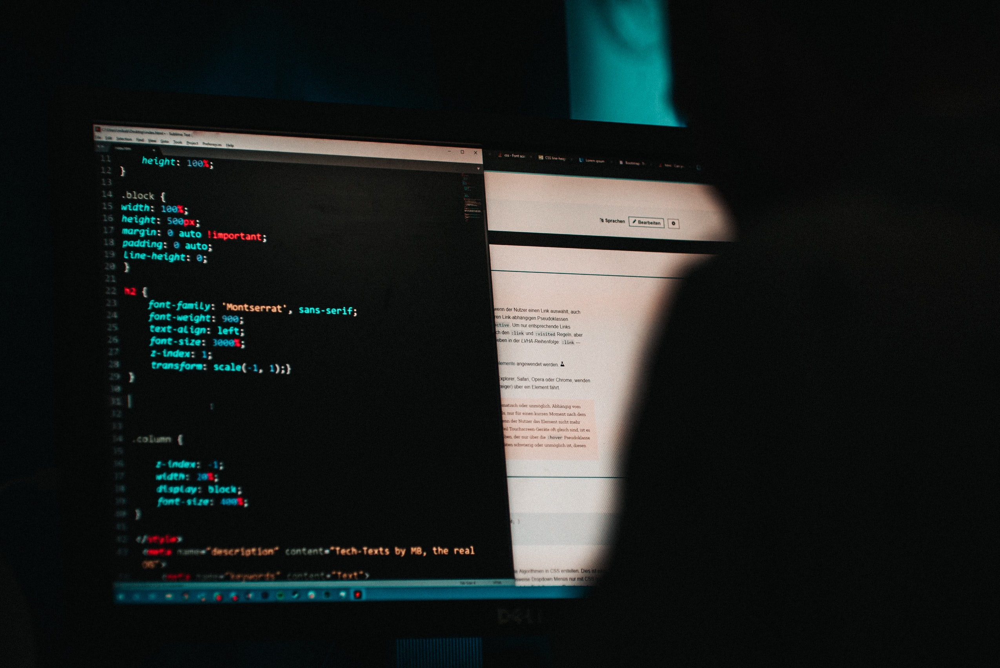

Wi-Fi is something we all use use every day, and is essential for connecting our devices to the internet.

Yet, Wi-Fi has some key vulnerabilities which make it susceptible to cracking, potentially opening up networks for hackers to snoop around in.

In this post I hope to highlight the importance of cyber security by demonstrating how simple Wi-Fi cracking can be.



Nowadays, most wireless networks are secured using either [WPA](https://en.wikipedia.org/wiki/Wi-Fi_Protected_Access#WPA) or [WPA2](https://en.wikipedia.org/wiki/Wi-Fi_Protected_Access#WPA2). Both of which are vulnerable to the methods described in this post.

Older networks are sometimes secured using [WEP](https://en.wikipedia.org/wiki/Wired_Equivalent_Privacy) — a totally insecure older standard which can be hacked without any password cracking whatsoever.

A growing number of networks are being secured with [WPA3](https://en.wikipedia.org/wiki/Wi-Fi_Protected_Access#WPA3), the next generation of WPA. It is currently impervious to the methods described here, but there is speculation that it mightn't be as secure as we'd like to hope… Read more [here](https://www.forbes.com/sites/kateoflahertyuk/2019/04/11/flaws-in-wpa3-wi-fi-standard-allow-attackers-to-crack-passwords-and-view-traffic/#ac1ab617050c).

The methods we will be using here are outlined excellently in [this](https://louisabraham.github.io/articles/WPA-wifi-cracking-MBP.html) blog post if you want more of a how-to.

I have also written a python script, available [here](https://github.com/Tommrodrigues/WiFiCrackPy), which automates the entire process.

## WPA attacks

There are three steps to a WPA attack:

1. Identifying the target network
2. Capturing a beacon and a handshake
3. Cracking the password using what we captured

## Identifying and capturing

Before we start, we need to extract some information from our target network:

- Name (SSID)
- MAC address (BSSID)
- Channel (Radio frequency)

Once we've done this, we need to capture a beacon frame. To do this, we simply wait for the network to advertise itself — something which happens many times a second, and is how your devices know there is a network to connect to.

More difficult, however, is capturing a WPA handshake.


Handshakes occur only when a device (re)connects to a network. For busier networks this isn't a problem as we can just wait until this happens naturally.

But, for networks where handshakes may happen less frequently, we can run a [deauthentication attack](https://en.wikipedia.org/wiki/Wi-Fi_deauthentication_attack) on the target to force a handshake.

## Deauthentication attacks

Deauthentication attacks force a device to disconnect from a network. This is commonly done as part of a denial of service attack, or as in our case, to force a handshake.

To perform the attack, the attacker poses as the access point, then sends [deauthentication frames](https://en.wikipedia.org/wiki/802.11#Deauthentication_frame) to those on the network, instructing that they disconnect from the network immediately.

The recipients follow the instruction faithfully, disconnecting instantly.

From here the attacker can stop the attack, and allow the devices to reconnect automatically, leading to handshakes we can capture.

On macOS, the simplest way to run a deauthentication attack is to use an app like [JamWiFi](https://github.com/0x0XDev/JamWiFi/releases).

## Cracking the password

After combining the beacon frame and handshake, we finally move on to cracking the password.

The Wi-Fi password is stored as a [hash](https://en.wikipedia.org/wiki/Hash_function) within our capture, and cannot be back-calculated. Instead, we have to test many possible passwords until we find the right one.

The most efficient way to do this is with a tool called [hashcat](https://hashcat.net/hashcat/).


Hashcat can work in a variety of ways, but its goal is to guess lots of possible passwords, hash them, and see if the result matches the hash target. If the hashed guess matches the target, we've cracked the password.

The most common attack methods are dictionary attacks and brute-force attacks.

### Dictionary attacks

Dictionary attacks are fairly simple, and are the fastest way to crack basic passwords. You supply a long list of common passwords (like [this](https://github.com/berzerk0/Probable-Wordlists/tree/master/Real-Passwords/WPA-Length) one), then each password is hashed and tested against the target.

This works great if the password is something like `newyork1`, but not so good if it's something like `LN3#ydA?GN3ZCs_3`.

### Brute-force attacks

In the case the password is more complicated, it might be better to perform a brute-force attack.

Here, you define a length and a possible character set, then every combination of that character set is tried within the defined length.

For example, if you set a length of 3, and a character set made of lowercase letters, it would output guesses like this:

```
aaa
baa
caa
...
zzx
zzy
zzz
```

This isn't too bad for smaller passwords, especially when you're just using lower or uppercase letters, but becomes computationally intensive very quickly.

The minimum length for a WPA password is 8 characters. For a password of this length, even just with upper or lowercase letters, brute-forcing will already take a considerable amount of time.

Furthermore, if you increase the password length and start adding in numbers, uppercase letters, and special characters, brute-forcing is completely unreasonable — think lifetime of the universe to crack a single password.

## Conclusion

Wi-Fi cracking is really very simple if the password is inadequate.

If you'd like to learn more or try it out for yourself, see [this](https://louisabraham.github.io/articles/WPA-wifi-cracking-MBP.html) blog post, and [this](https://github.com/Tommrodrigues/WiFiCrackPy) automated python script.

When it comes to choosing a Wi-Fi password to better protect yourself from this sort of attack, your best bet is using a random password generator which uses a mixture of upper and lowercase letters, numbers, and special characters to make a password 20 or more characters long.

Do this, and you can set your mind at ease — unless somebody is willing to wait until the heat death of the universe, your network should be safe!

## Links

- [Automated Python Script](https://github.com/Tommrodrigues/WiFiCrackPy)
- [JamWiFi](https://github.com/0x0XDev/JamWiFi/releases)
- [WPA cracking blog post](https://louisabraham.github.io/articles/WPA-wifi-cracking-MBP.html)
